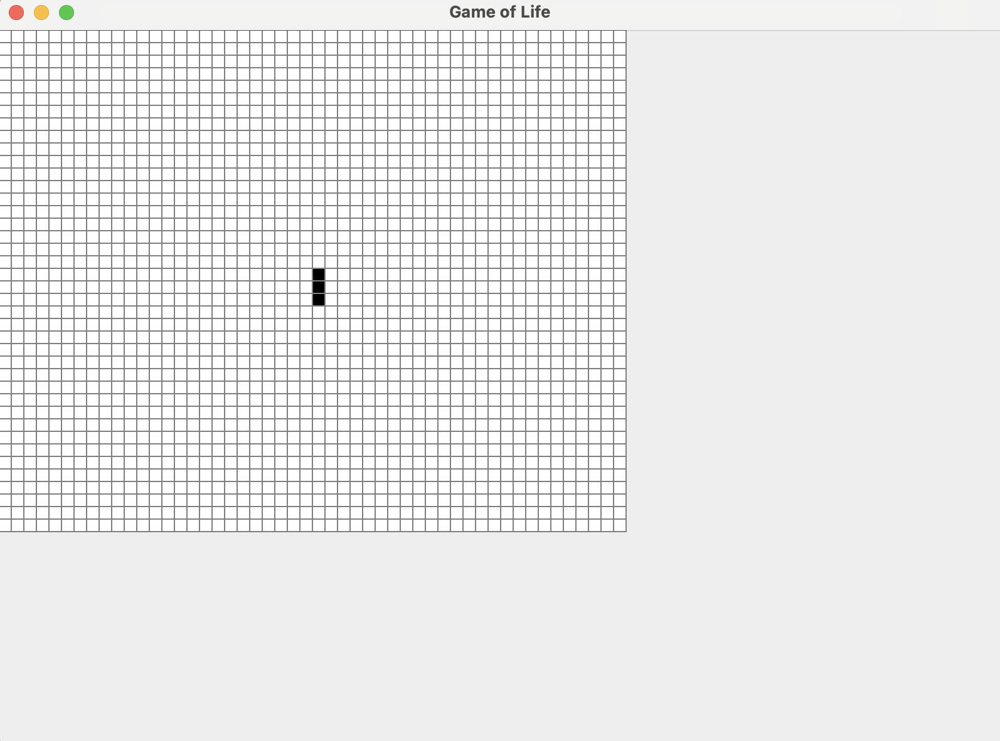

# Conway's Game of Life

Conway's Game of Life is a cellular automaton where cells on a grid live, die, or reproduce based on simple rules that consider the state of neighboring cells. It simulates the evolution of patterns over generations, creating complex behavior from simple initial conditions.
[game](https://playgameoflife.com/)
[wiki](https://en.wikipedia.org/wiki/Conway%27s_Game_of_Life)

### Technology 
[Timer](https://www.geeksforgeeks.org/java-util-timer-class-java/)